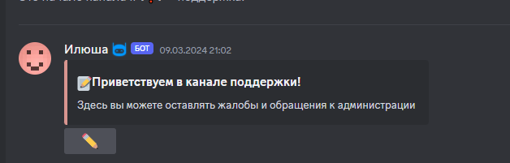
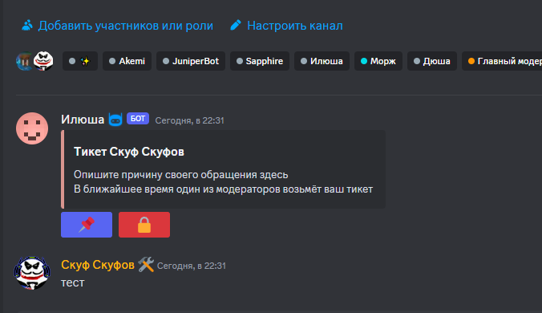
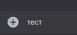
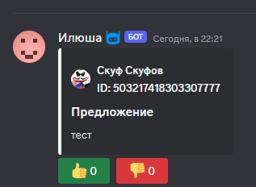
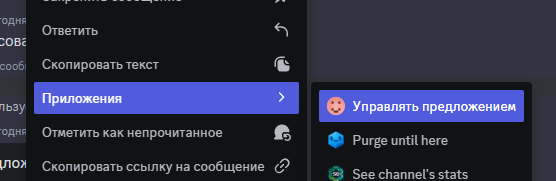

# Робоморж
Бот робоморж с помощью которого можно управлять сервером
## Система тикетов
### Создание тикета
Создать тикет можно, нажав на кнопку в данном сообщении, которое отправляется в определенный канал 

Далее, создается новый канал в разделе `Новые тикеты`, который называется исходя из шаблона в конфиге 

В данный канал отправляется сообщение от бота, содержащие 2 кнопки:
1. Закрепить тикет.
2. Закрыть тикет.
Все кнопки должны настраиваться по ролям

### Закрепить тикет
Если тикет закрепляется, то он просто перемещается в категорию `Закрепленные тикеты`

### Удаление тикета
Если тикет удаляется, то канал перемещается в категорию `Удаленные тикеты`. Так-же блокируется полный доступ взаимодействия с тикетом и он становится доступным только для прочтения

Удаленные тикеты сохраняются в базе данных. Все сообщения в тикете так-же удаляются.  
Должна присутствовать возможность импортировать логи тикета в txt файл

## Система предложений
### Создание предложения
Предложение создается путем отправки сообщения в определенный канал.

После чего, сообщение пользователя заменяется на настраиваемое сообщение бота 

### Управление тикетом
Далее, через систему приложений должна быть реализована возможность установить тикету статус, изменить текст, оставить комментарий, или удалить его 

На все действия настраиваются роли.

